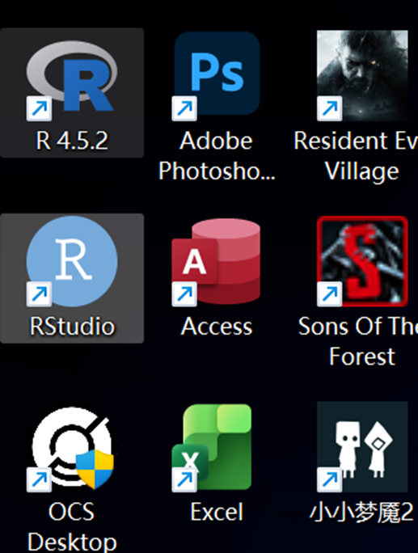
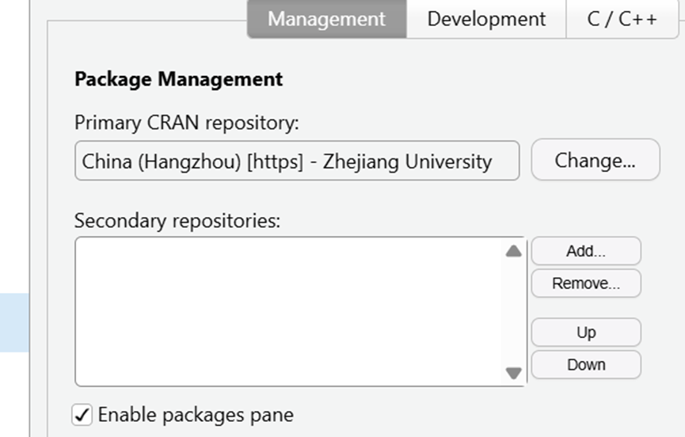
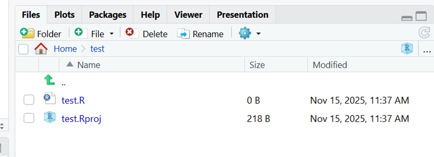
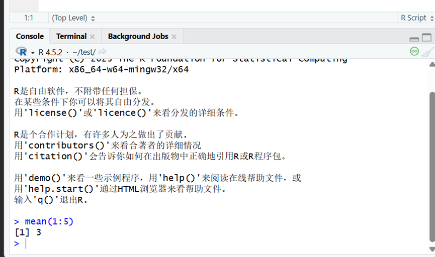
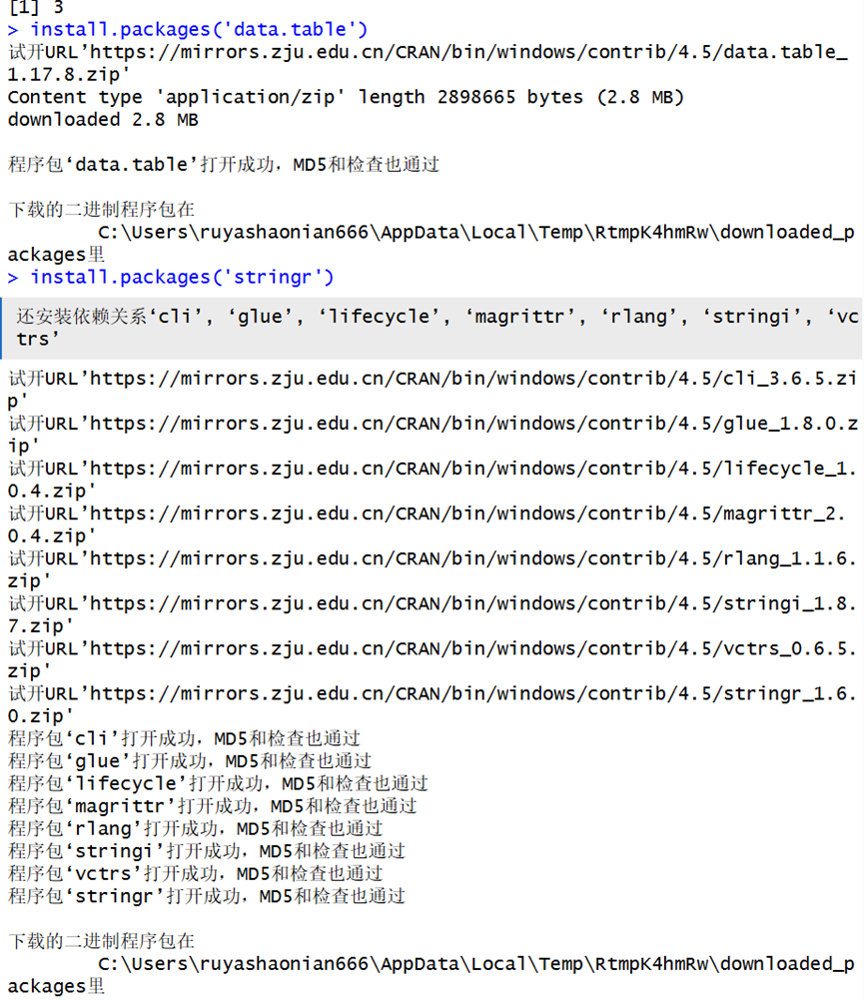
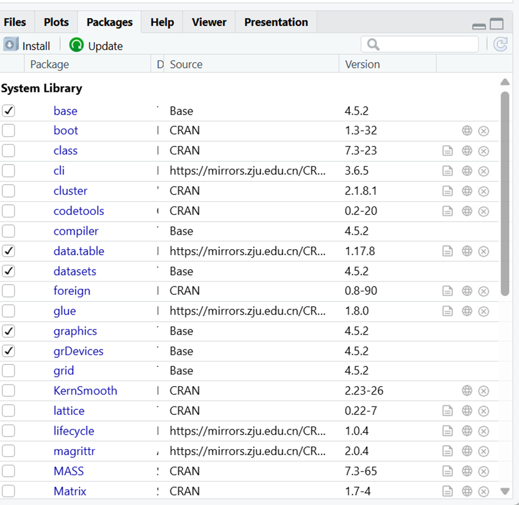
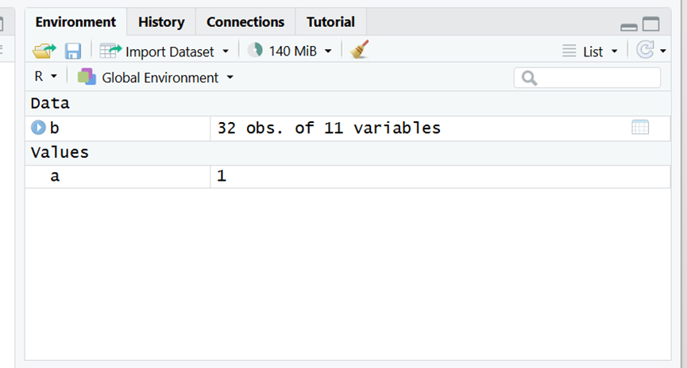

# 作业1

1.R语言是一门解释型语言，是一种高级语言，核心是一种命令式语言。起源于20世纪70年代john chambers 在贝尔实验室带头开发的S语言。在金融、市场营销，医药、社会科学等场景进行大数据统计，应用领域有数学统计和数学分析。

2.**RStudio**是一个免费的开源集成开发环境（IDE），专门为R语言设计。与R语言的区别：

1.RStudio提供了一个直观的图形界面，用户可以通过菜单和按钮进行操作，而不需要记住复杂的命令。

2.RStudio支持项目管理，可以方便地组织和管理代码文件、数据文件和输出结果。

3.RStudio内置了强大的调试工具，可以设置断点、逐步执行代码、查看变量值等。

4.RStudio提供了丰富的可视化工具，可以轻松创建和编辑图表，并支持多种输出格式。

3.{width="180" height="200"}

4.{width="313"}

5和6.

# 作业2

1.一行和多行可以点击run，快捷键Ctrl+enter

2.{width="300" height="200"}

3.install.packages('包名')

{width="300" height="200"}

4.用library

](images/clipboard-55475979.png)

5.不用重新安装，但需要重新导入

6.赋值符号：\<-，快捷键alt+-

](images/clipboard-1647199052.png)

8.用#进行注释，快捷键Ctrl+shift+c
